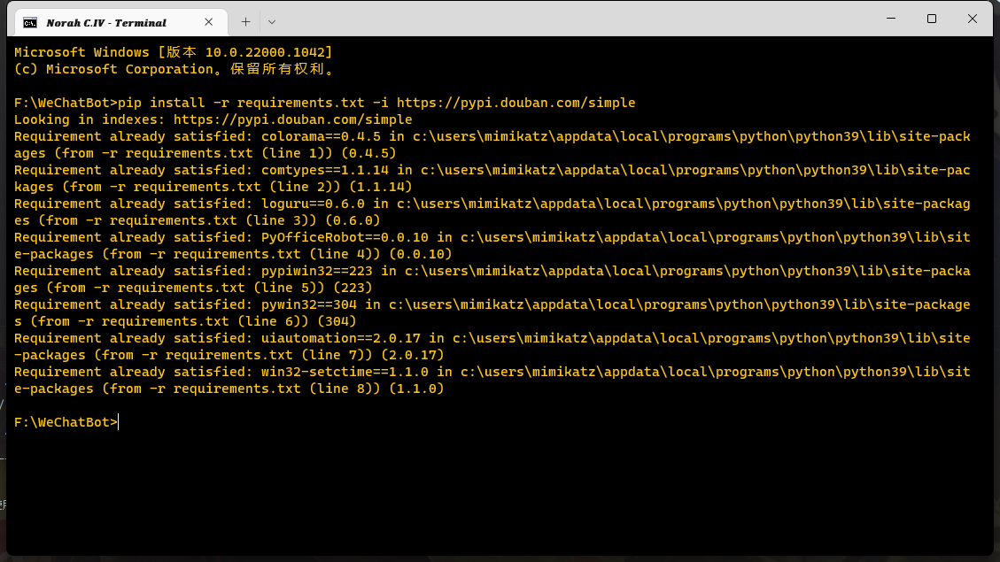
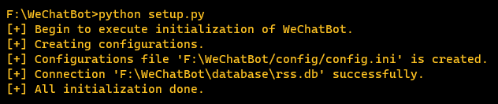
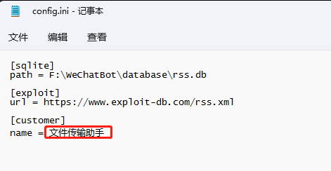
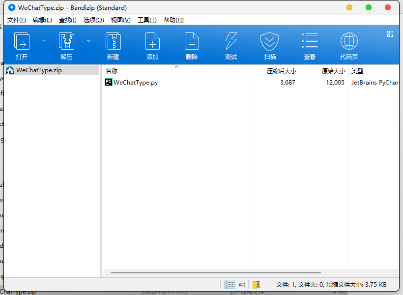
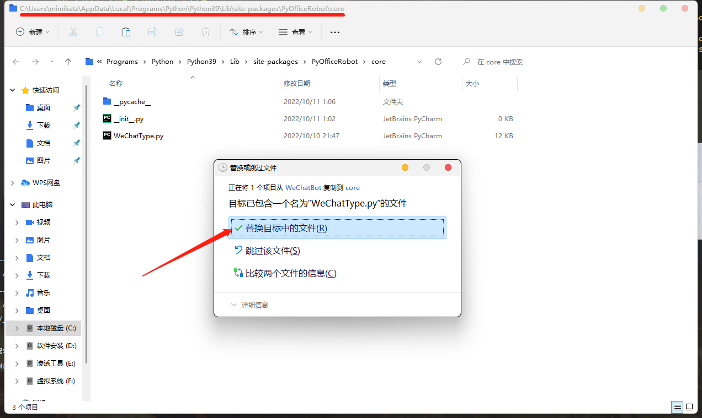
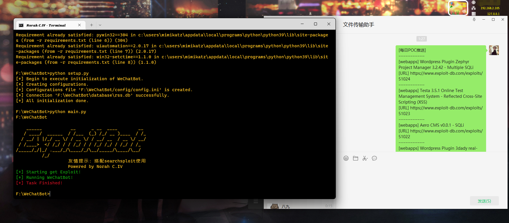

# Exploit-WeChatBot
## 安装
`
pip install -r requirements.txt -i https://pypi.douban.com/simple
`

`
python setup.py
`

## 编辑配置文件

## 编辑 PyOfficeRobot 文件
`解压 WeChatType.zip`

`覆盖 WeChatType 文件`

## 开始程序
`python main.py`

## Todo
添加定时任务……